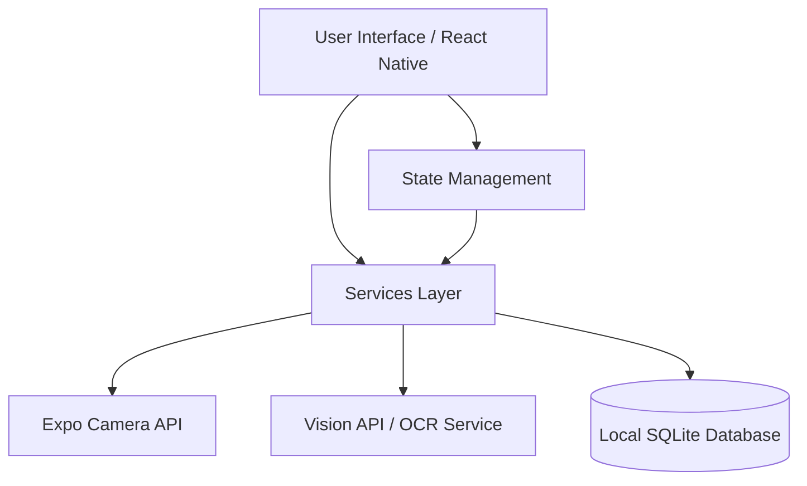

<h1 align="center">App Ponto</h1>

<p align="center">
  
  
  
  
</p>

## Overview
App Ponto is a local-first mobile application designed to help employees track their daily work hours automatically. By taking a picture of their time clock receipt, the app extracts the hours and calculates the "bank of hours" balance, ensuring precise personal record-keeping without relying on external corporate systems.

## The Problem
In many workplaces, internal corporate systems for tracking the "bank of hours" (balanço de horas trabalhadas) can be opaque or inaccurate. Employees often receive small paper receipts when they clock in and out, but manually calculating and organizing these times is tedious, prone to error, and hard to reconcile with HR records at the end of the month.

## The Solution
App Ponto automates this process. The user simply snaps a photo of their printed time clock receipt. The application uses Optical Character Recognition (OCR) to automatically extract the punch times, calculates the total hours worked for the day against the standard workday, and updates a local, private database of their hours.

## Key Features
- **Automated Data Entry:** Scan time clock receipts with the device camera.
- **OCR Extraction:** Uses Vision APIs to accurately read dates and timestamps from physical paper.
- **Bank of Hours Calculation:** Automatically tallies daily hours and calculates overtime or deficits.
- **Privacy First:** 100% local processing and storage. No data is sent to employer servers.
- **Offline Capable:** Works without an internet connection for basic record viewing and local DB operations.

## Architecture



For a deeper dive into isolation and state management, see [Architecture Docs](./docs/architecture.md).

## Technology Stack
- **Frontend / Mobile:** React Native, Expo
- **Database:** SQLite (Local)
- **APIs:** Vision API (for OCR)
- **Language:** JavaScript / TypeScript

## Business & System Requirements

| Business Requirement | System Solution |
| :--- | :--- |
| **Frictionless input** | Integration with device camera and OCR to avoid manual typing. |
| **Data Privacy** | Local SQLite database to ensure the employee owns their data. |
| **Accurate Tracking** | Automated calculation logic within the app to compute daily balances. |
| **Cross-platform usage** | React Native framework to support both iOS and Android company devices. |

See [Requirements Docs](./docs/requirements.md) for more details.

## Testing & Validation
The application relies heavily on mocking to isolate the camera and OCR services from the core calculation logic during automated testing. 
To run the local test suite:

```bash
npm test
# or
yarn test
```
See [Testing Docs](./docs/testing.md) for the complete mocking strategy.

## Deployment
This app is designed to be built and deployed via Expo.
To run locally:
```bash
npx expo start
```
To build standalone APK/IPA:
```bash
eas build --profile production
```

## Project Status
**Active / Validation Phase.** The core OCR extraction and hour calculation logic have been validated in real-world usage with actual time clock receipts. The UI/UX is currently being expanded to include better historical charting and export features.

## Screenshots
*(Add your screenshots to the docs/assets/ folder and link them here)*
- [Home Screen](./docs/assets/home.png)
- [Scanner View](./docs/assets/scanner.png)
- [History View](./docs/assets/history.png)

## My Role
**Full Stack Developer**
- **Requirements Analysis:** Identified the business problem within the company and conceptualized the automated OCR solution.
- **Architecture:** Designed a privacy-first, local-only architecture using React Native.
- **Integration:** Implemented device camera APIs and integrated OCR for text extraction.
- **Business Logic:** Developed the calculation algorithms for the "bank of hours".
- **Testing:** Implemented automated tests for calculation edge cases.

## Architecture Decisions
- **Why React Native/Expo?** Allowed rapid prototyping and deployment to both iOS and Android without managing complex native toolchains.
- **Why Local SQLite?** Ensured 100% data privacy for the employee and provided offline capabilities out-of-the-box.
- **Why Vision API / OCR?** It was the core enabler of the "frictionless" requirement, transforming a tedious manual entry app into an automated utility.

## Limitations & Future Work
- **Lighting Conditions:** The OCR accuracy can drop in poor lighting. Future work includes adding image enhancement filters before processing.
- **Exporting Data:** Currently, data is only viewable in-app. Adding PDF/CSV export is prioritized for HR disputes.
- **Cloud Backup:** Adding an optional, user-controlled cloud backup (e.g., Firebase Auth) to prevent data loss on device reset, completely decoupled from employer systems.
