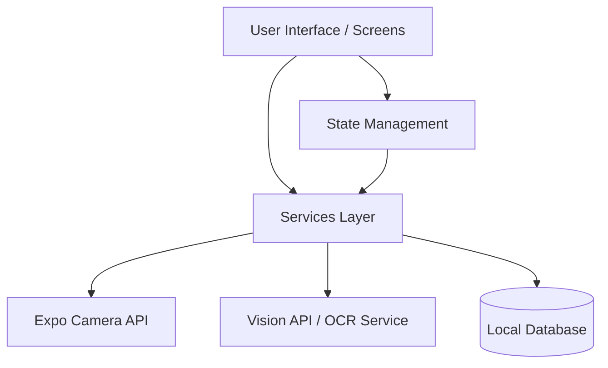

# Architecture Decisions

This document outlines the architectural decisions and patterns used in the App Ponto project.

## Overview
The application is built using **React Native** and **Expo**. It operates completely locally without a custom backend server, emphasizing data privacy and simplicity. The primary functionality is to capture images of time clock receipts and automatically extract the relevant data (hours worked) to maintain a precise "bank of hours".

## Architecture Diagram

## Key Decisions

### 1. React Native & Expo
**Why React Native?** Cross-platform compatibility allowing the app to run on both iOS and Android from a single codebase, which is crucial for internal company tools distributed among employees with varying devices.
**Why Expo?** Streamlines the development process, providing easy access to native device APIs (like the camera) without needing to manage native builds directly.

### 2. Local-First Data Storage
**Decision:** Store the bank of hours locally on the device.
**Rationale:** The initial scope of the app is to empower individual employees to track their own hours to reconcile with the company's records. A local database guarantees data privacy and allows the app to function offline.

### 3. OCR Integration
**Decision:** Automatic extraction of data from receipts via OCR (Optical Character Recognition).
**Rationale:** Manual data entry is tedious and prone to errors. By leveraging device capabilities or third-party vision APIs, the process is streamlined to simply taking a photo.

## State Management and Isolation
- **Separation of Concerns:** UI components (`/screens`) are isolated from business logic and API integrations (`/services`).
- **Data Flow:** The UI triggers service calls (e.g., capturing an image), the service processes the data (OCR), and the result is stored in the local database. State is then updated to reflect the new data in the UI.
